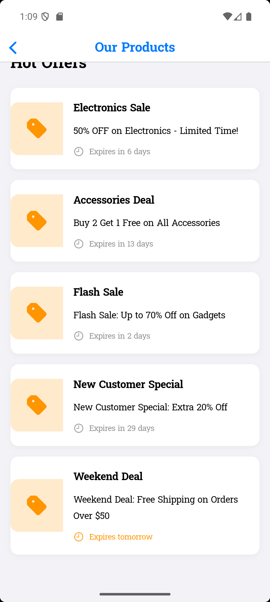
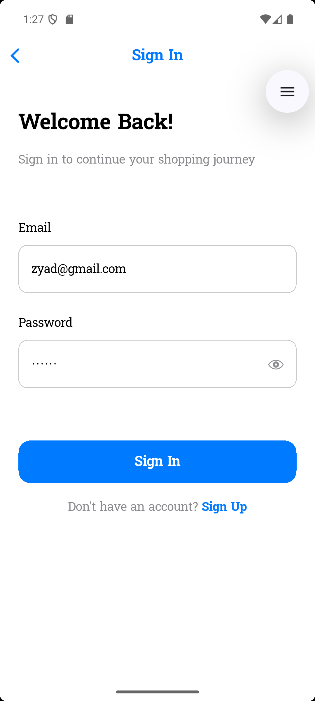
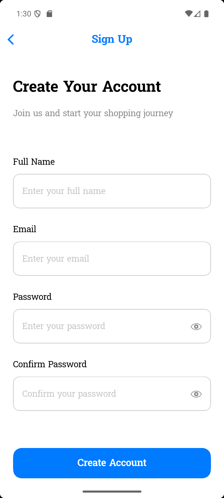
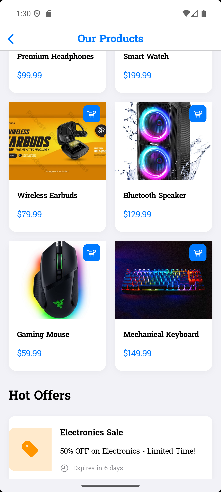
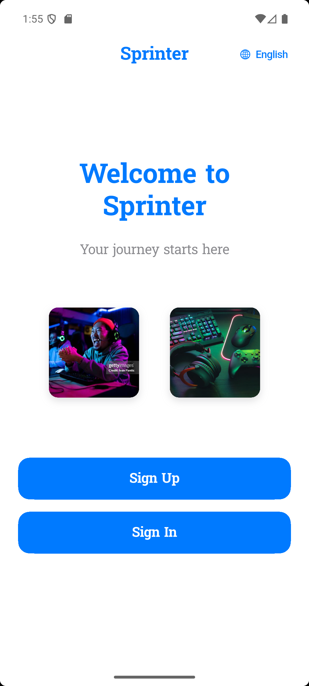
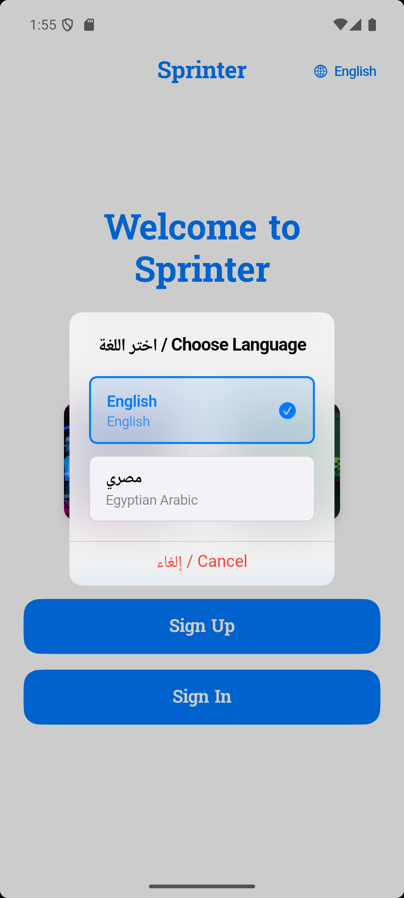

# 🚀 Sprinter - Flutter Shopping App

A modern, iOS-style Flutter shopping application with comprehensive authentication, product browsing, and bilingual support (English & Egyptian Arabic).

## ✨ Features

### 🔐 Authentication System
- **Sign Up Screen**: Full name, email, password validation
- **Sign In Screen**: Email and password authentication
- **Form Validation**: Real-time validation with custom regex patterns
- **Success Dialogs**: Confirmation messages after successful actions
- **Smooth Transitions**: Fade animations between screens

### 🛍️ Shopping Experience
- **Welcome Screen**: Beautiful landing page with app branding
- **Featured Products**: Horizontal PageView with product carousel
- **Product Grid**: 2-column grid layout with product cards
- **Hot Offers**: List of current promotions and deals
- **Add to Cart**: Interactive cart functionality with SnackBar feedback

### 🌍 Internationalization
- **Bilingual Support**: English and Egyptian Arabic languages
- **Language Switcher**: Easy toggle between languages
- **RTL Support**: Proper Arabic text direction
- **Localized Content**: All text, forms, and messages translated
- **No Hardcoded Strings**: Professional localization implementation

### 🎨 Design & UX
- **iOS-Style**: Cupertino widgets throughout
- **Custom Fonts**: Suwannaphum via Google Fonts
- **Responsive Layout**: Adapts to different screen sizes
- **Smooth Animations**: Page transitions and interactions
- **Modern UI**: Clean, professional interface design

## 🏗️ Project Structure

```
lib/
├── main.dart                          # App entry point with localization setup
├── screens/                           # Application screens
│   ├── welcome_screen.dart           # Landing page with navigation
│   ├── signup_screen.dart            # User registration form
│   ├── signin_screen.dart            # User authentication form
│   └── shopping_home_screen.dart     # Main shopping interface
├── widgets/                           # Reusable UI components
│   └── language_switcher.dart        # Language selection widget
├── utils/                            # Utility classes and helpers
│   ├── font_utils.dart               # Typography management
│   └── validation_utils.dart         # Form validation logic
└── assets/                           # App resources
    ├── images/                       # Product and UI images
    ├── icons/                        # App icons
    └── translations/                 # Localization files
        ├── en.arb                    # English translations
        └── ar.arb                    # Egyptian Arabic translations
```

## 🚀 Getting Started

### Prerequisites
- Flutter SDK (3.2.3 or higher)
- Dart SDK
- Android Studio / VS Code
- iOS Simulator / Android Emulator

### Installation

1. **Clone the repository**
   ```bash
   git clone https://github.com/yourusername/sprinter_ass.git
   cd sprinter_ass
   ```

2. **Install dependencies**
   ```bash
   flutter pub get
   ```

3. **Run the application**
   ```bash
   flutter run
   ```

### Dependencies

The app uses the following key packages:

```yaml
dependencies:
  flutter:
    sdk: flutter
  cupertino_icons: ^1.0.2
  google_fonts: ^6.1.0
  easy_localization: ^3.0.3
```

## 🔧 Configuration

### Localization Setup
The app automatically supports English and Egyptian Arabic. Language switching is available via the globe icon in the navigation bar.

### Font Configuration
- **Primary Font**: Suwannaphum (via Google Fonts)
- **Fallback**: System fonts for compatibility
- **Automatic**: No manual font file management required

## 📱 Screenshots

# hot offers 


# signin


# signup


# products


# Shopping Home Screen


# Welcome Screen


# Language Selection


---

*All screenshots showcase the app's bilingual support (English & Arabic) and iOS-style design*

## 🎯 Code Quality Standards

### Architecture Principles
- **Separation of Concerns**: Each screen/widget in its own file
- **Single Responsibility**: Each class has one clear purpose
- **Clean Architecture**: Organized folder structure
- **Reusable Components**: Widgets designed for reuse

### Code Standards
- **No Hardcoded Strings**: All text uses localization
- **Clear Naming**: Descriptive variable/function/class names
- **Proper Formatting**: Consistent code style
- **No Duplicates**: DRY principle followed
- **Error Handling**: Graceful error management

### Performance
- **Efficient Rendering**: Optimized widget rebuilds
- **Memory Management**: Proper disposal of controllers
- **Lazy Loading**: Images and content loaded as needed
- **Smooth Animations**: 60fps transitions

## 🧪 Testing

### Run Tests
```bash
flutter test
```

### Code Analysis
```bash
flutter analyze
```

### Format Code
```bash
flutter format .
```

## 🌟 Key Features Implementation

### Authentication Flow
1. **Welcome Screen** → User chooses Sign Up or Sign In
2. **Form Validation** → Real-time input validation
3. **Success Dialog** → Confirmation message
4. **Navigation** → Smooth transition to shopping home

### Shopping Experience
1. **Featured Products** → Horizontal scrolling carousel
2. **Product Grid** → Browse all available products
3. **Add to Cart** → Interactive shopping functionality
4. **Hot Offers** → Current promotions and deals

### Localization System
1. **Language Detection** → Automatic locale detection
2. **Text Translation** → All UI elements localized
3. **RTL Support** → Proper Arabic text direction
4. **Language Switching** → Instant language change

## 🔒 Security Features

- **Input Validation**: Comprehensive form validation
- **Password Security**: Minimum length requirements
- **Email Validation**: Proper email format checking
- **Data Sanitization**: Clean input processing

## 📊 Performance Metrics

- **App Size**: Optimized bundle size
- **Startup Time**: Fast app initialization
- **Memory Usage**: Efficient resource management
- **Battery Life**: Minimal background processing

## 🚀 Deployment

### Build for Production
```bash
# Android
flutter build apk --release

# iOS
flutter build ios --release

# Web
flutter build web --release
```

### Platform Support
- ✅ Android (API 21+)
- ✅ iOS (12.0+)
- ✅ Web (Chrome, Firefox, Safari, Edge)
- ✅ Windows (10+)
- ✅ macOS (10.14+)
- ✅ Linux (Ubuntu 18.04+)

## 🤝 Contributing

1. Fork the repository
2. Create a feature branch
3. Make your changes
4. Add tests if applicable
5. Submit a pull request

## 📄 License

This project is licensed under the MIT License - see the [LICENSE](LICENSE) file for details.

## 🙏 Acknowledgments

- Flutter team for the amazing framework
- Google Fonts for typography
- Easy Localization for internationalization
- Cupertino design guidelines

## 📞 Support

For support and questions:
- Create an issue in the repository
- Contact the development team
- Check the documentation

---

**Built with ❤️ using Flutter**
